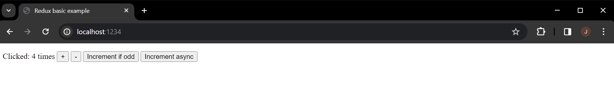

# web603-class-w6d1

## Getting Started

Create a folder named "counter-vanilla" and drop `index.html` into the folder.

Add the updated file `package.json` as follows:

```json
{
  "name": "counter-vanilla",
  "version": "1.0.0",
  "description": "A simple counter implemented using Redux",
  "scripts": {
    "start": "parcel index.html --open",
    "build": "parcel build index.html"
  },
  "dependencies": {
    "@babel/core": "7.23.9",
    "@reduxjs/toolkit": "^2.2.0"
  },
  "devDependencies": {
    "parcel": "^2.11.0",
    "process": "^0.11.10"
  }
}
```

With `counter-vanilla` as the current directory, run `npm install`.

Then in the project root, add a `.gitignore` to include `node_modules/`.

## Build the App

The app is using web bundler, so see `npm start` and `npm run build` commands below:

```json
  "scripts": {
    "start": "parcel index.html --open",
    "build": "parcel build index.html"
  },
```

To check build, run `npm run build`, but it's optional.

Run `npm start` to let the web page popped up in a browser. Notice that the port used is 1234, not 3000.

## Test



1. The "+" button: the counter increments by 1 as fast as you click the button.
2. The "-" button: the counter decrements by 1 as fast as you click the button.
3. The "Increment if odd" button: the counter increments by 1 only when the current count is odd.
4. The "Increment async" button: the counter increments by 1 asynchronously. A wait time of 1000 ms was set by us in the code. As you quickly click the button 10 times, the counter won't take a 10 seconds to increment by 10.

```
  1  click  ----- (1s) ----- counter + 1
  2   click  ----- (1s) ----- counter + 1
  3    click  ----- (1s) ----- counter + 1
  4     click  ----- (1s) ----- counter + 1
  5      click  ----- (1s) ----- counter + 1
  6       click  ----- (1s) ----- counter + 1
  7        click  ----- (1s) ----- counter + 1
  8         click  ----- (1s) ----- counter + 1
  9          click  ----- (1s) ----- counter + 1
 10           click  ----- (1s) ----- counter + 1
```
